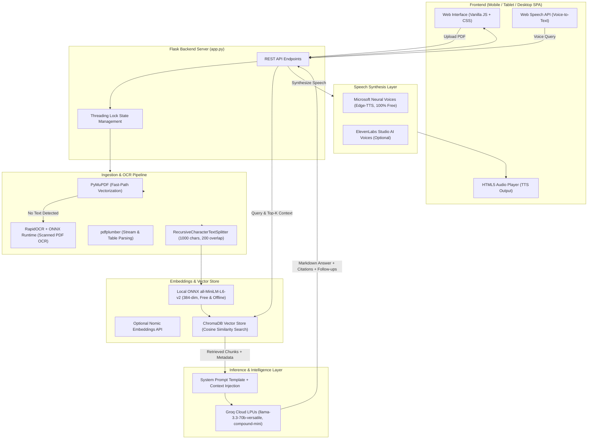

# 🧠 CogniPDF AI — Enterprise Multi-PDF Research & Neural Voice Workspace

An enterprise-grade, multi-document **Retrieval-Augmented Generation (RAG)** system built with **Flask**, **LangChain**, **Groq LPUs**, **ChromaDB**, **RapidOCR**, and **Neural Speech Synthesis (Edge-TTS + ElevenLabs)**.

CogniPDF allows users to upload multiple PDF documents simultaneously (including scanned/image-only PDFs), index them locally into a semantic vector database, and interact via voice and chat with source citations, page-level passage inspection, dynamic follow-up generation, and audio playback.

---

## 🏛️ System Architecture



---

## 🛠️ Comprehensive Tech Stack

### 1. Backend & Server
- **Language**: Python 3.10+
- **Web Framework**: Flask 3.1.3 (RESTful architecture, JSON API)
- **WSGI Production Server**: Gunicorn 26.2.0 (configured with `--workers 1 --threads 4 --timeout 120` for thread-safe state management)
- **Concurrency Control**: Python `threading.Lock()` mutex preventing race conditions during parallel file ingestion and deletion.
- **Environment Management**: `python-dotenv` for secure environment variable isolation.

### 2. LLM Orchestration & Inference
- **Orchestration Framework**: LangChain Core & LangChain Groq
- **LLM Inference Provider**: **Groq Cloud LPUs** (Language Processing Units providing sub-second inference speeds)
- **Primary LLM**: `llama-3.3-70b-versatile` (70-Billion Parameter Meta Llama model running on Groq LPUs)
- **Context Routing**: Dynamic top-k vector chunk injection with token-budget control.

### 3. Vector Database & Embedding Layer
- **Vector Database**: **ChromaDB 0.4.22+ / 1.5+** (In-memory semantic vector store with metadata filtering)
- **Primary Embedding Model**: **`all-MiniLM-L6-v2`** via local ONNX Runtime (384-dimensional dense vectors, runs 100% locally and free with zero API keys).
- **Secondary Cloud Embedding**: **`nomic-embed-text-v1.5`** (optional cloud integration via `langchain-nomic`).

### 4. PDF Extraction & OCR Layer
- **Tier 1 (Fast-Path)**: **`PyMuPDF (fitz)`** — C-accelerated native PDF parser extracting text in sub-milliseconds.
- **Tier 2 (Stream & Table Fallback)**: **`pdfplumber`** — Precision character and tabular data extractor.
- **Tier 3 (Local OCR Engine)**: **`RapidOCR` + `onnxruntime`** — Lightweight OCR engine that automatically activates when scanned or image-only PDFs are uploaded.

### 5. Speech Synthesis (TTS) & Voice Dictation
- **Microsoft Neural Speech**: **`edge-tts`** — Free, studio-quality neural voices (*Aria, Guy, Jenny, Christopher, Sonia, Ryan*).
- **ElevenLabs AI**: **ElevenLabs API** integration for hyper-realistic cloned voice personalities (*Rachel, Adam, Antoni, Bella, Josh*).
- **Voice Dictation (STT)**: Native browser **Web Speech API** for hands-free speech-to-text queries.

### 6. Frontend & UI/UX
- **Architecture**: Single Page Application (SPA) with zero external heavyweight UI frameworks.
- **Styling**: Modern Vanilla CSS with responsive design system (Desktop, Tablet, Mobile).
- **Markdown & Code Highlighting**: `marked.js` with `highlight.js` for syntax highlighting across code blocks.
- **Navigation**: Segmented View Control (`Research Chat` vs `Document Hub`) on mobile/tablet viewports ($\le 1024\text{px}$).

---

## 🤖 AI Models Used & Their Specific Purpose

| Model Name | Category | Provider | Purpose in CogniPDF AI |
| :--- | :--- | :--- | :--- |
| **`llama-3.3-70b-versatile`** | Large Language Model (LLM) | Meta / Groq | Default reasoning model. Synthesizes answers, generates exact citations, and predicts 3 dynamic follow-up questions. |
| **`groq/compound-mini`** | Large Language Model (LLM) | Groq | Ultra-fast low-latency reasoning model for quick summaries and quick prompts. |
| **`openai/gpt-oss-120b`** | Large Language Model (LLM) | Groq | Flagship open-weight model for complex document comparisons and multi-document reasoning. |
| **`qwen/qwen3.6-27b`** | Large Language Model (LLM) | Qwen / Groq | Multilingual and mathematical reasoning over scientific and tabular documents. |
| **`all-MiniLM-L6-v2`** | Dense Embedding Model | Sentence-Transformers / ONNX | Converts document text chunks into 384-dimensional vectors for semantic cosine similarity search. Runs 100% locally. |
| **`nomic-embed-text-v1.5`** | Dense Embedding Model | Nomic AI | Optional 768-dimensional high-context (8,192 token) cloud vector embedding model. |
| **`RapidOCR (PP-OCRv4)`** | Optical Character Recognition (OCR) | PaddlePaddle / ONNX | Scans image-only PDFs and extracts printed text directly without external cloud APIs. |
| **`en-US-AriaNeural`** | Neural Text-to-Speech | Microsoft Neural | Default natural expressive voice for reading out answers aloud. |
| **`ElevenLabs MultiLingual v2`** | Neural Voice Cloning | ElevenLabs | Optional studio-grade voice personalities for audiobook-style playback. |

---

## 📡 API Endpoints Reference

| Endpoint | Method | Payload / Params | Response | Description |
| :--- | :---: | :--- | :--- | :--- |
| `/` | `GET` | None | HTML | Serves the main Single Page Application. |
| `/status` | `GET` | None | JSON | Returns API connection status, loaded document count, page stats, chunk counts, and available models. |
| `/upload` | `POST` | `multipart/form-data` (`file: .pdf`) | JSON | Parses PDF, extracts text/OCR, generates vector embeddings, and indexes chunks in ChromaDB. |
| `/ask` | `POST` | `{ "question": str, "model": str }` | JSON | Performs Top-K retrieval, calls Groq LLM, and returns the answer, source citations, latency, and 3 follow-up prompts. |
| `/tts` | `POST` | `{ "text": str, "voice": str }` | Audio Stream (MP3) | Synthesizes speech using Edge-TTS or ElevenLabs and returns binary audio stream. |
| `/delete-file` | `POST` | `{ "filename": str }` | JSON | Removes a specific PDF from disk and deletes its corresponding vector embeddings from ChromaDB. |
| `/clear` | `POST` | None | JSON | Clears all uploaded files, deletes vector database indexes, and resets session state. |
| `/clear-history` | `POST` | None | JSON | Clears the active conversation context log in memory. |
| `/update-config`| `POST` | `{ "api_key": str, "model": str }` | JSON | Dynamically updates runtime API keys and model preferences. |

---

## ⚙️ Environment Variables

Create a `.env` file in the project root:

```env
# Required for LLM Reasoning (Get free key at https://console.groq.com/keys)
GROQ_API_KEY=gsk_your_groq_api_key_here

# Optional Default Model Configuration
GROQ_MODEL=llama-3.3-70b-versatile

# Optional: ElevenLabs Voice API Key (https://elevenlabs.io)
ELEVENLABS_API_KEY=your_elevenlabs_key_here

# Optional: Nomic Embeddings API Key (https://nomic.ai)
NOMIC_API_KEY=your_nomic_key_here
```

---

## 🚀 Installation & Local Development

### 1. Clone Repository
```bash
git clone https://github.com/asadshaa/Pdf_Chatbot.git
cd Pdf_Chatbot
```

### 2. Create Virtual Environment
```bash
python -m venv venv
# On Windows:
venv\Scripts\activate
# On Linux / macOS:
source venv/bin/activate
```

### 3. Install Dependencies
```bash
pip install -r requirements.txt
```

### 4. Run the Application
```bash
python app.py
```
Open **[http://127.0.0.1:5000](http://127.0.0.1:5000)** in your browser.

---

## 🌐 Production Deployment (Render)

The application includes `render.yaml` configuration for 1-click deployment on Render:

1. Connect your GitHub repository to **[Render.com](https://render.com)**.
2. Select **Web Service** with the following settings:
   - **Environment**: `Python`
   - **Build Command**: `pip install -r requirements.txt`
   - **Start Command**: `gunicorn app:app --workers 1 --threads 4 --timeout 120`
3. Add Environment Variable:
   - `GROQ_API_KEY` = `your_gsk_key_here`
4. Click **Deploy**.

---

## 📄 License
This project is open-source and available under the **MIT License**.
